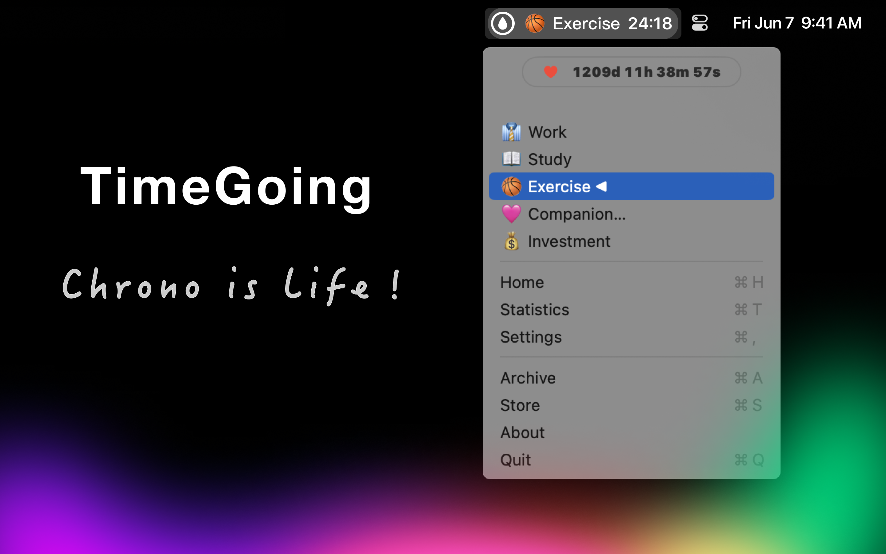
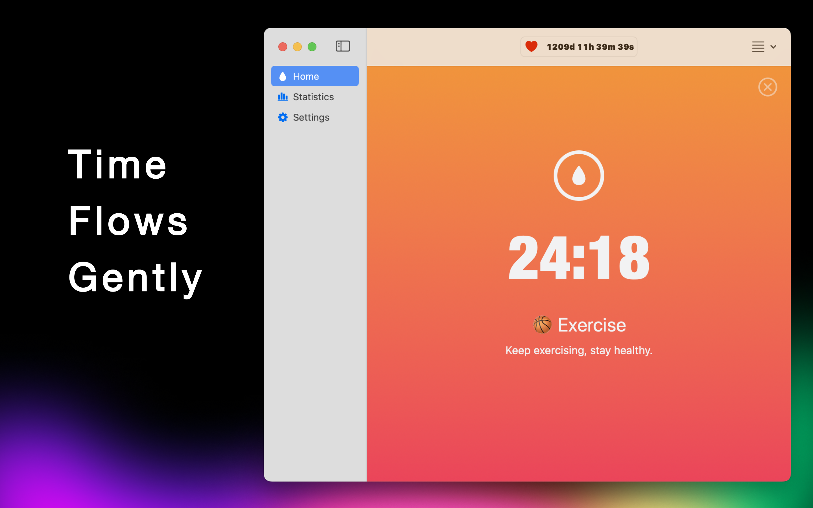
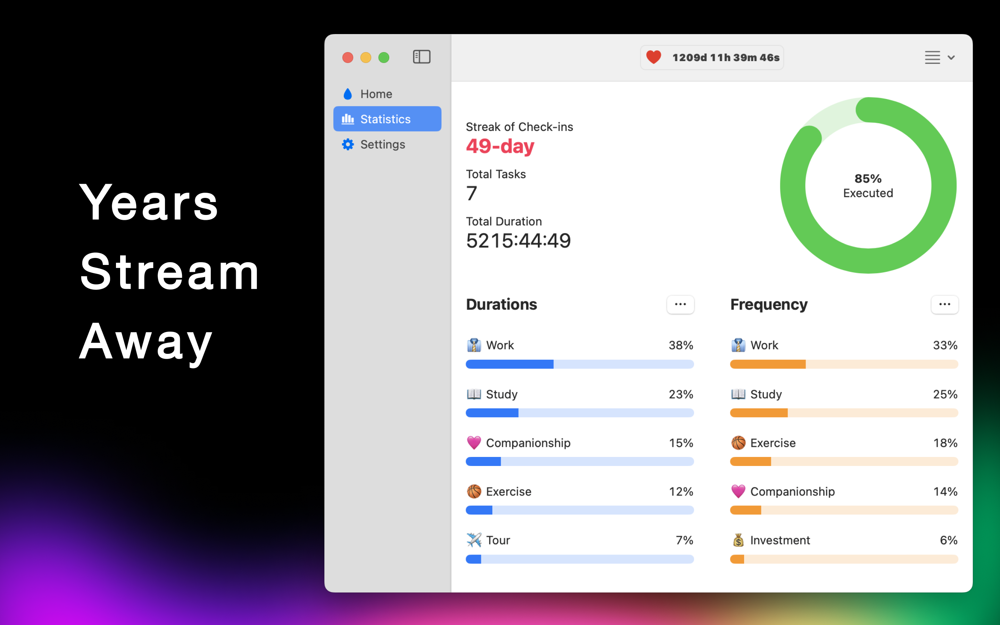
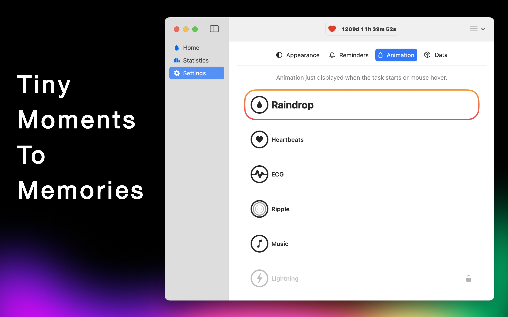

# TimeGoing: Chrono is Life

[中文](./README.md)

### Introduction

Always feel like you don’t have enough time? Always procrastinating and getting nothing done?  
Our app helps you track your time and how much you spend on each task.  
Starting now, give every task a sense of ceremony, and believe that by sticking with it, you’ll feel an improvement in focus and efficiency.

**Stop procrastinating, download for free now! Make your time more valuable!**

### Download

| App Store | DMG |
| --- | --- |
|  |  |

### Features

* Status Bar Timer: One-tap start for instant focus
* Status Bar Menu: Seamless switching, convenient and hassle-free
* Sync: iCloud data sync for cross-device access
* Daily Check-ins: Habit-building with daily reminders
* Animations: Visual progress to keep you motivated
* Task Management: Work diligently, live joyfully
* Drag & Drop Sorting: Intuitive and simple
* Reminders: Set flexible times, get timely alerts
* Archive: Save history to track your growth
* Backup: Self-service backups to avoid data loss
* Precision timing: With second-accurate calibration for perfectionists
* App Life: Your companion for personal growth
* Charts & Stats: Regular reviews for continuous improvement

### Screenshot

