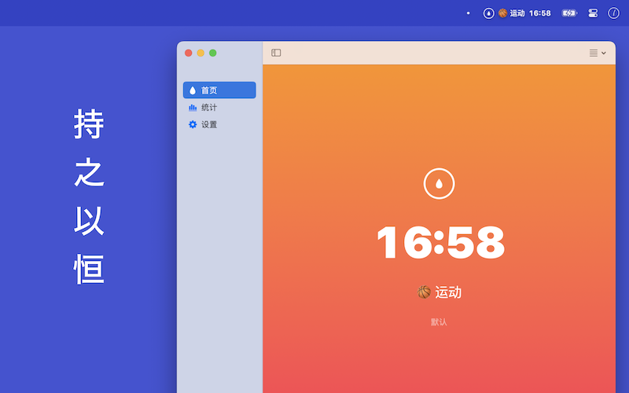
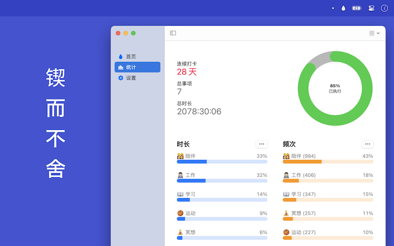

# 时流记 - 相信坚持的力量！

你是否有过这样的困扰？
总是想做很多事情却总是没有时间？
总是拖延到最后什么都没有做？

我们的应用可以帮助你养成记录时间的好习惯，让你知道自己花费了多少时间在什么事情上。   
从现在开始给每件事情赋予仪式感，相信坚持一段时间后你一定能感受到专注和效率提升。

拒绝拖延，立即免费下载！让你的时间更有价值吧！

* 记录：自由规划，一键启停
* 同步：iCloud 自动同步，安全省心
* 打卡：习惯养成，每日见证成长
* 动画：直观展示时光流逝，激励前行
* 列表管理：合理分组，工作生活两不误
* Siri 快捷指令：一句话启动事项，更快更方便
* 桌面小组件：实时掌握事项状态，动态更新
* 主屏快捷菜单：长按直达，操作更流畅
* 拖拽排序：符合直觉，操作更简单
* 提醒：自定义提醒间隔，再忙也不会忘
* 存档：保存重要事项，记录每一步成长
* 时长校准：支持手动校准时长，强迫症福音
* 应用生命：坚持的路上，你并不孤单！
* 统计图表：定期回顾分析，持续改进优化

## Download

